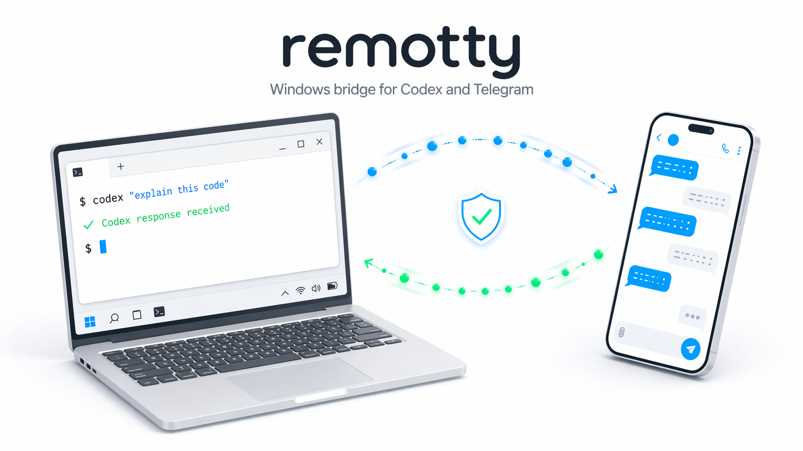

[English](README.md) | [日本語](README.ja.md)

# remotty



`remotty` is a Windows bridge for sending Telegram messages to local Codex.

The main v0.2 path returns to a saved Codex thread. You bind a Telegram chat
to a thread, send a message from Telegram, and `remotty` relays it through
`codex app-server`. The reply goes back to the same Telegram chat.

`remotty` does not type into the open Codex App window. It uses the supported
saved-thread interface that the local Codex command exposes.

> [!WARNING]
> **Disclaimer**
>
> This is an unofficial community project. It is not affiliated with,
> endorsed by, or sponsored by OpenAI.
> `Codex`, `ChatGPT`, and related marks are trademarks of OpenAI.
> They are referenced here only to describe the local tools that `remotty`
> works with. All other trademarks belong to their owners.

## What It Does

- Connects a Telegram bot to local Codex on Windows.
- Lets a Telegram chat select a saved Codex thread.
- Sends Telegram text to the selected thread with `codex app-server`.
- Returns the Codex reply to the same Telegram chat.
- Relays approval prompts back to Telegram.
- Stores bot tokens in Windows protected storage.
- Keeps `remotty` state under `%APPDATA%\remotty`.

The older `exec` transport is still available. It starts a separate
`codex exec` run, so it does not return to a saved Codex thread.

## When To Use It

Use `remotty` when you want to step away from your Windows PC and continue a
local Codex thread from Telegram.

Use Codex Remote connections when the project itself lives on an SSH target.
That feature connects the Codex App to a remote machine. `remotty` is for
reaching the Codex setup on your Windows PC from Telegram.

## Requirements

- Windows 10 or Windows 11
- Codex App and Codex CLI
- Node.js and `npm`
- A Telegram bot token from `@BotFather`

Rust is only needed when you build from source.

## Quick Start

For the guided Telegram setup, use the
[Telegram Quickstart](docs/telegram-quickstart.md).

Want to try the local loop before making a Telegram bot?
Use the [Fakechat Demo](docs/fakechat-demo.md).

### 1. Install `remotty`

```powershell
npm install -g remotty
```

This installs the `remotty` command. It also downloads the matching Windows
binary from GitHub Releases.

### 2. Open the package folder

```powershell
$remottyRoot = Join-Path (npm root -g) "remotty"
Set-Location $remottyRoot
```

Open this same folder in the Codex App when you install the local plugin.

### 3. Copy the starter config

```powershell
$configDir = Join-Path $env:APPDATA "remotty"
New-Item -ItemType Directory -Force -Path $configDir | Out-Null
Copy-Item -Force .\bridge.toml (Join-Path $configDir "bridge.toml")
$configPath = Join-Path $configDir "bridge.toml"
```

Your settings and runtime state now live under `%APPDATA%\remotty`.

### 4. Install the local plugin

In the Codex App, open the installed `remotty` package folder.
In the Plugins view, add `.agents/plugins/marketplace.json`.
Then install the plugin named `remotty`.

The plugin provides setup commands such as:

```text
/remotty-configure
/remotty-start
/remotty-access-pair <code>
/remotty-sessions
```

### 5. Configure the Telegram bot token

Create a bot with `@BotFather`, then run:

```text
/remotty-configure
```

The command asks for the token and stores it in Windows protected storage.
It does not print the token back.

### 6. Choose the transport

Edit `%APPDATA%\remotty\bridge.toml`.

For the saved-thread path, set:

```toml
[codex]
transport = "app_server"
```

Set `workspaces[0].path` and `workspaces[0].writable_roots` to the project
folder that Codex may use.

If you only want the older separate-run bridge, keep:

```toml
[codex]
transport = "exec"
```

### 7. Start the bridge

```text
/remotty-start
```

Keep the bridge running while you use Telegram.

### 8. Pair Telegram

Send any message to your bot in Telegram. The bot replies with a pairing code.

Back in Codex, run:

```text
/remotty-access-pair <code>
/remotty-policy-allowlist
```

Only allowlisted senders can send work or approval decisions.

### 9. Select a saved thread

List saved Codex threads:

```text
/remotty-sessions
```

Bind the Telegram chat to a thread:

```text
/remotty-sessions <thread_id>
```

After that, Telegram messages go to the selected saved thread.

## Common Telegram Commands

```text
/help
/status
/stop
/approve <request_id>
/deny <request_id>
/workspace
/workspace <id>
/remotty-sessions
/remotty-sessions <thread_id>
/mode completion_checks
/mode infinite
/mode max_turns 3
```

When `codex.transport = "app_server"`, approval prompts can also appear as
Telegram buttons.

## Migration From v0.1

The v0.1 setup mainly used `codex.transport = "exec"`. That path starts a new
Codex CLI run for Telegram work.

The v0.2 setup should use `codex.transport = "app_server"` when you want
Telegram to continue a saved Codex thread.

See [Migration From v0.1](docs/migration-v0.1-to-v0.2.md).

## Security

- Use `/remotty-configure` so bot tokens stay in Windows protected storage.
- Use a dedicated Telegram bot for `remotty`.
- Do not paste bot tokens or `api.telegram.org/bot...` URLs into issues.
- Keep project files separate from `%APPDATA%\remotty` runtime state.

## Related Docs

- [Telegram Quickstart](docs/telegram-quickstart.md)
- [Fakechat Demo](docs/fakechat-demo.md)
- [Migration From v0.1](docs/migration-v0.1-to-v0.2.md)
- [Development](docs/development.md)

## License

[MIT](LICENSE)
